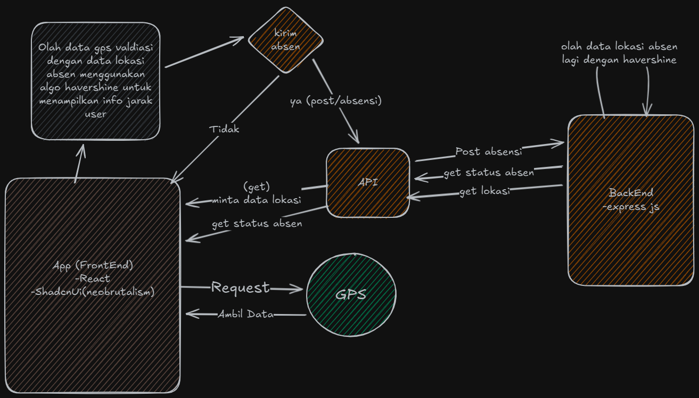

Attendify adalah aplikasi absensi berbasis web yang menerapkan Metode Prototype, memanfaatkan GPS dan Algoritma Haversine untuk memvalidasi kehadiran pengguna berdasarkan jarak lokasi.
Pengguna hanya dapat melakukan absensi apabila berada dalam radius lokasi yang telah ditentukan oleh admin.

Aplikasi ini dikembangkan sebagai bagian dari Tugas Akhir dengan tujuan menghasilkan sistem absensi yang akurat, efisien, dan berbasis lokasi.
**Tujuan Sistem** 

-Mengurangi kecurangan absensi

-Memastikan kehadiran berdasarkan lokasi geografis

-Memberikan validasi jarak secara real-time

-Menyediakan informasi lokasi (latitude & longitude) kepada pengguna

**Metode yang Digunakan**

-Metode Pengembangan: Prototype

-Algoritma: Haversine Formula

-Teknologi Lokasi: GPS (Geolocation API Browser)

